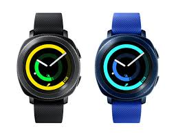
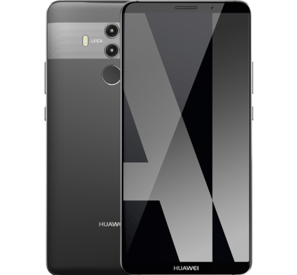

## Smartwatch: Samsung Gear sport 

### Bruikbare specificaties
 - Spraakherkenning
 - Hoogte barometer
 - Betalingen verrichten
 - stappenteller
 - Locatie
 - Aanraakscherm
 - Bluetooth
 - Door te draaien aan de roterende ring, kunnen de apps bediend worden
 - magnetometer
 - Dimensies 42.9 x 44.6
 - OS: Tizen OS 3.0

#### (onbruikbare) specificaties
 - snelheidsmeter
 - verzamelen activiteitsgegevens
 - intern geheugen van 4 GB + 768 MB
 - Tachymeter
 - waterresistant

#### Design Principles 
<http://developer.samsung.com/gear/design/visual-design>

## Smartphone: Huawei Mate Pro 10

### Bruikbare specificaties
 - Schermgrootte van 6 inch
 - Resolutie: 2160 1080
 - GPS
 - Wifi
 - Bluetooth

#### (onbruikbare) specificaties
 - 3D Camera
 - Vingerafdrukscanner
 - Geïntegreerde NPU
 - Water -en stofbestendig

#### Design Principles 
<https://developer.android.com/about/versions/oreo/android-8.0.html>